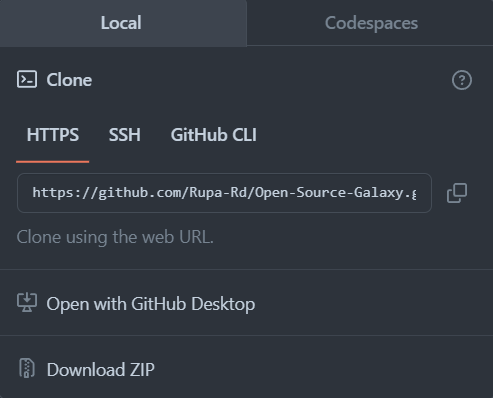

# 
Welcome to Contributing! 

I'm thrilled you're interested in being part of this project. This guide is here to help you get started, whether you're a seasoned developer or just starting your open source journey.

## Getting Started

1. Explore the Project: Take some time to familiarize yourself with the project's goals, codebase, and documentation. A good starting point is usually the README file.

2. Set Up Your Development Environment: Follow the instructions below to set up your development environment. 

3. Star the Project: Don't forget to star project inorder to support the project.

    

4. Raise Issue: Go through the website and look for the imrpovement or a bug. Once you find your bug or improvement, raise a issue in the issue section and wait for the issue to assign.

## How to Contribute

1. Fork the repository:

    Click on the fork button to get the copy of Open source galaxy repository to your profile.
    
2. Clone the repository:

    Once forked the repository, click the code and copy the http link.
    
    Once copied, navigate to command prompt or any other ide command prompt, enter the command below.
    ` git clone <copied link>  `
3. Create a new branch:

    After cloning the repo in your local machine, create a new branch. 
    ` git branch <new branch name> `

    Make sure to provide the branch some reasonable name Eg: modified-ui

4. Edit and commit the changes:
    Switch to the newly created branch and edit the changes in new branch. Note: Do not edit in main branch

    ` git checkout <new branch name> `

    Once you made changes, add the changes and commit the changes with some reasonable commit messages. Eg: 'Edited the UI of the main page.'

    To add the edited file to git:

    `git add <filename>`

    To commit the edited changes:

    `git commit -m "Commit message goes here" `

5. Push the changes:
    Once all the changes are commited, push the changes to remote branch using the below command.

    `git push origin <new branch name>`

6. Create a PR:
    
    Once the commits are pushed, create a Pull Request with the changes, steps and the output screenshots.

7. Wait for the review:
    
    Once you created a PR, wait for us to review the changes and approve the PR. We will then merge the PR once its verified.

<b> Thank you for being a part of this project! </b>

